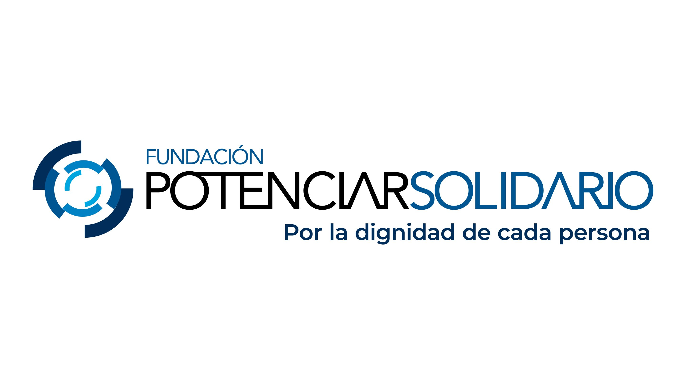

# Potenciar Solidario

    

Acompañan a más de 450 organizaciones sociales a fortalecer su gestión a través de soluciones, para que puedan desempeñarse de forma eficiente y transparente, crecer sustentablemente y con foco social a través de diversos programas. 
Sus 4 pilares fundamentales son:
* Plataformas: Portal digital para ONG potenciadas con mas de 900 usuarios. Plataformas CRM y ERP
* Equipo: con mas de 150 voluntarios y comunidades de voluntarios, consejo de administracion y equipo dedicado
* Desarrollo de fondos diversificado: 334.840.791 en 2024. Personas, empresas, fundaciones donantes y Noche del Encuentro Solidario.
* Aliados de gestión: Más de 20 empresas e instituciones especialistas en necesidades comunes de ONG potenciadas.

# Autor

<table align= 'center'>
    

        <tr>
            <td align= 'center'>
                 <strong>Marco Caro</strong> 
                
                
            </td>
        </tr>
    

</table>