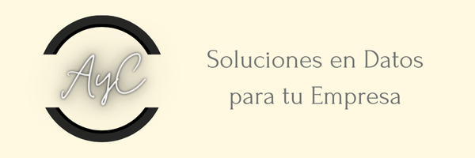

# Introduccion

    

Somos la Consultora AyC, que se dedica a desarrollar soluciones basadas en datos para nuestros clientes.

La finalidad de este trabajo es resolver la problematica planteada por nuestro cliente, que se presenta con una seria de problemas generales a resolver.

La Fundación “Potenciar Solidario” necesita asistencia para analizar, gestionar y visualizar datos administrativos:
* <strong>Objetivo del Proyecto:</strong> Crear un sistema eficiente que permita a los usuarios administrativos de ONGs actualizar y realizar el seguimiento de los ingresos y gastos de su organización y a los directores de la ONG tomar decisiones basadas en los datos presentados en los reportes.

Necesitamos ayudar a una ONG brindándole un dashboard que le permita llevar el seguimiento de sus ingresos y egresos económicos. El requisito mínimo es que incluya:

- Ingresos: Totales mensuales y anuales.
- Categorías generales de ingresos: Por ejemplo provenientes de donaciones o proveedores, etc.
- Egresos: Totales mensuales y anuales.
- Categorías principales de gastos: Como administración y proyectos.
- La evolución mensual de ingresos y egresos.
- La distribución de ingresos y egresos por categoría.
- Balance general: Diferencia mensual entre ingresos y egresos.
- Filtros básicos: Filtros por mes y año para ver datos específicos de ciertos períodos.

 

# Potenciar Solidario

    

Acompañan a más de 450 organizaciones sociales a fortalecer su gestión a través de soluciones, para que puedan desempeñarse de forma eficiente y transparente, crecer sustentablemente y con foco social a través de diversos programas. 
Sus 4 pilares fundamentales son:
 

* Plataformas: Portal digital para ONG potenciadas con mas de 900 usuarios. Plataformas CRM y ERP
* Equipo: con mas de 150 voluntarios y comunidades de voluntarios, consejo de administracion y equipo dedicado
* Desarrollo de fondos diversificado: 334.840.791 en 2024. Personas, empresas, fundaciones donantes y Noche del Encuentro Solidario.
* Aliados de gestión: Más de 20 empresas e instituciones especialistas en necesidades comunes de ONG potenciadas.

Se puede ver su perfil de ONG y desarrollo en su sitio web  -->  [Aquí](https://potenciarsolidario.org/)

 

# Datos

La fuente de datos a utilizar es alimentada en parte por datos de la ONG Potenciar Solidario

# Autor

<table align= 'center'>
    

        <tr>
            <td align= 'center'>
                 <strong>Marco Caro</strong> 
                
                
            </td>
        </tr>
    

</table>